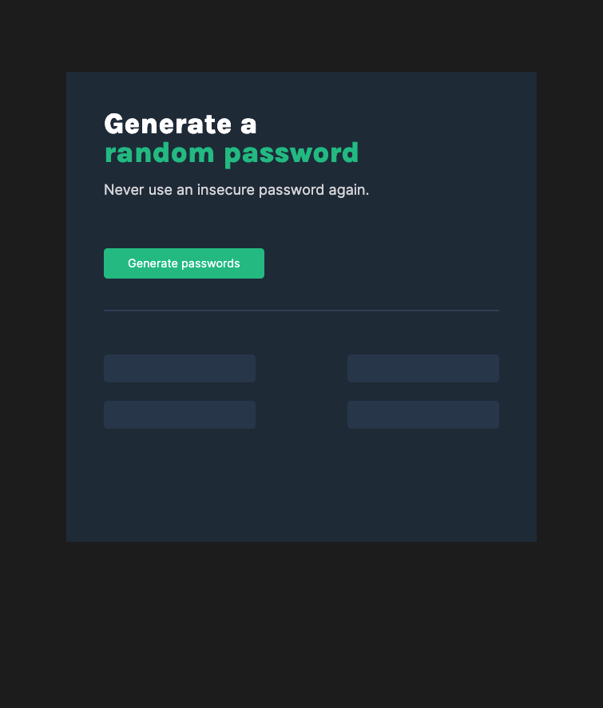

# random-password-generator

An app that generates 4 unique passwords for users with the click of a button. Random Password Generator (RPG) utilizes DOM manipulation, for loops, functions and more to reach the desired solution.

Fonts provided by [Google Fonts](https://fonts.google.com/)
